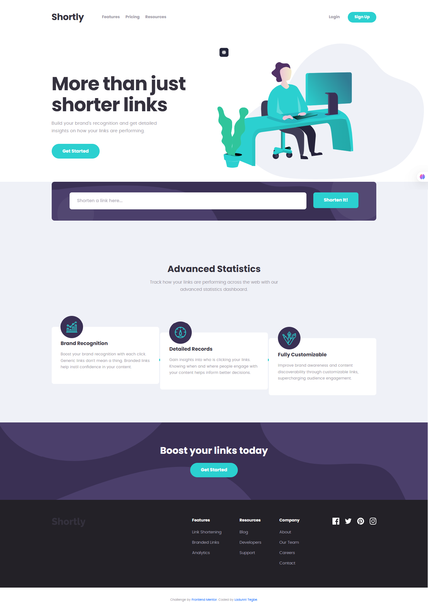

# Frontend Mentor - Shortly URL shortening API Challenge solution

This is a solution to the [Shortly URL shortening API Challenge challenge on Frontend Mentor](https://www.frontendmentor.io/challenges/url-shortening-api-landing-page-2ce3ob-G). Frontend Mentor challenges help you improve your coding skills by building realistic projects. 

## Table of contents

- [Overview](#overview)
  - [The challenge](#the-challenge)
  - [Screenshot](#screenshot)
  - [Links](#links)
- [My process](#my-process)
  - [Built with](#built-with)
  - [What I learned](#what-i-learned)
  - [Continued development](#continued-development)
  - [AI Collaboration](#ai-collaboration)
- [Author](#author)
- [Acknowledgments](#acknowledgments)


## Overview

This website allows a user to enter a long URL and get it shorten.

### The challenge

Users should be able to:

- View the optimal layout for the site depending on their device's screen size
- Shorten any valid URL
- See a list of their shortened links, even after refreshing the browser
- Copy the shortened link to their clipboard in a single click
- Receive an error message when the `form` is submitted if:
  - The `input` field is empty

### Screenshot




### Links

- Solution URL: [https://github.com/Ladunnitegbe/URL-shortening-API-landing-page.git]
- Live Site URL: [https://url-shortening-api-landing-page-kohl.vercel.app/]

## My process

### Built with

- Semantic HTML5 markup
- CSS custom properties
- Flexbox
- CSS Grid
- [Bootstrap](https://getbootstrap.com/)


### What I learned

```js
 if (raw && !/^https?:\/\//i.test(raw)) {
      raw = 'https://' + raw;
    }
```


### Continued development

Javascript Async code
React


### AI Collaboration

Worked to generate API to shorten URLs

## Author

- Website - [Ladunni Tegbe](https://www.your-site.com)
- Frontend Mentor - [@Ladunnitegbe](https://www.frontendmentor.io/profile/yourusername)
- LinkedIn - [Ladunni Akinsola Tegbe](https://www.linkedin.com/in/ladunni-akinsola-tegbe/?lipi=urn%3Ali%3Apage%3Ad_flagship3_profile_view_base_contact_details%3BR4rXd7k4TzmzMoPyam0wZA%3D%3D)


## Acknowledgments

Josephine Ohwifo - https://www.linkedin.com/in/josephineohwifo/?lipi=urn%3Ali%3Apage%3Ad_flagship3_profile_view_base_contact_details%3B2ZwTswgvTVSmVP9dEqLBeQ%3D%3D

Eduaina Ighalo - https://www.linkedin.com/in/eduaina-ighalo/?lipi=urn%3Ali%3Apage%3Ad_flagship3_profile_view_base_contact_details%3BdtINipeZSCupo9J9dr6BZw%3D%3D
